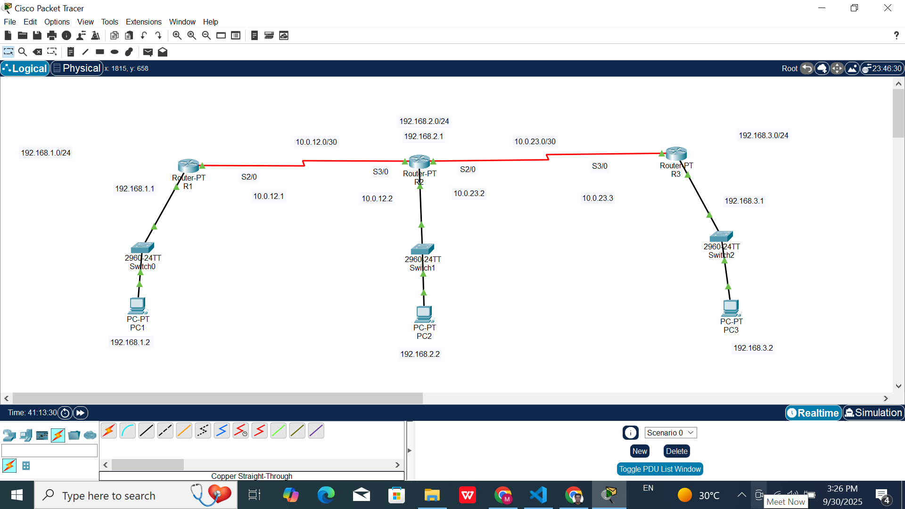

# 🛠️ Static Routing Lab (Cisco Routers)

## 📌 Objective
Connect three routers and their LANs using **default static routes**.  
Verify end-to-end connectivity between PCs across different subnets.  

---

## 🌐 Network Topology
- **Routers:** R1, R2, R3  
- **Switches:** One per router  
- **LANs:** PCs connected behind each router  
- **WAN Links:** Point-to-point connections using /30 subnets  

  
*(Replace with your diagram or Packet Tracer screenshot)*  

---

## 📊 IP Addressing Scheme

| Device | Interface         | IP Address      | Subnet Mask       | Description        |
|--------|------------------|-----------------|------------------|--------------------|
| R1     | G0/0             | 192.168.1.1     | 255.255.255.0    | LAN 1              |
| R1     | S0/0/0           | 10.0.12.1       | 255.255.255.252  | Link to R2         |
| R2     | G0/0             | 192.168.2.1     | 255.255.255.0    | LAN 2              |
| R2     | S0/0/0           | 10.0.12.2       | 255.255.255.252  | Link to R1         |
| R2     | S0/0/1           | 10.0.23.2       | 255.255.255.252  | Link to R3         |
| R3     | G0/0             | 192.168.3.1     | 255.255.255.0    | LAN 3              |
| R3     | S0/0/0           | 10.0.23.3       | 255.255.255.252  | Link to R2         |

---

## ⚙️ Configuration Files
All router configs are saved in the [`configs/`](configs) folder:  
- [R1](configs/R1.txt)  
- [R2](configs/R2.txt)  
- [R3](configs/R3.txt)  

---

## ✅ Verification
1. **Check interfaces**  
